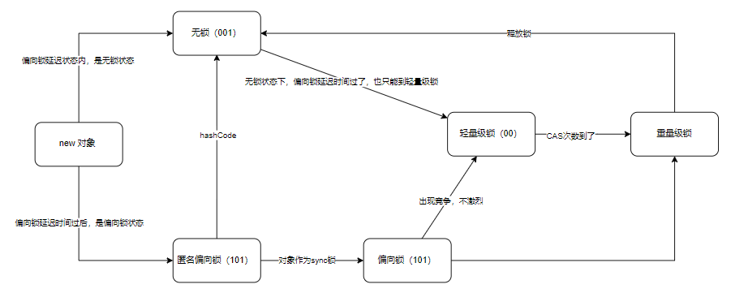

# 你背的“八股文”已经过时了，偏向锁早被JDK 15废弃了！
JDK 15为什么要废弃偏向锁？要解决这个问题，得先来复习一下synchronized关键字。在Java中，synchronized是最基本最常用的锁机制，其底层原理涉及到对象头（Object Header）和监视器（Monitor）。监视器其实就是一种同步机制，用于管理对象的锁和线程的等待集，让我们把重点放在对象头上。

### 对象头锁标识

对象头是Java虚拟机（JVM）中对象内存布局的一个重要组成部分，每个对象都由三部分组成：对象头、实例数据和对齐填充。对象头中包含了对象的元数据信息，这些信息对JVM的运行时数据模型至关重要。

对象头的主要组成部分包括两部分：

*   Mark Word
    

这是对象头中的核心部分，它存储了对象的哈希码（HashCode）、对象的年龄（对于垃圾收集器来说）以及对象的同步状态（例如，是否被锁定）。在JDK 1.6及之后的版本中，Mark Word还用于实现锁优化技术，如偏向锁。Mark Word的结构会根据对象的锁状态（无锁、偏向锁、轻量级锁、重量级锁）而变化。

*   Class Pointer
    

这个部分存储了对象指向它的类元数据的指针。这个指针允许JVM通过对象实例快速访问到类的定义。在某些情况下，比如当对象是数组时，Class Pointer会指向数组的类型信息。

对象头的大小取决于JVM的实现和运行的平台。在64位JVM中，对象头通常占用128位（16字节），其中Mark Word占64位，Class Pointer占64位。而在32位的系统中，Mark Word占32位。下面来看看64位虚拟机环境，不同锁状态下的Mark Word结构。

<table>
    <tr>
        <th rowspan="2">锁状态</th>
        <th rowspan="2" colspan="2">56bit</th>
        <th rowspan="2">1bit</th>
        <th rowspan="2">4bit</th>
        <th>1bit</th>
        <th>2bit</th>
    </tr>
    <tr>
       <th>是否偏向锁</th>
        <th>锁标志位</th>
    </tr>
    <tr>
        <td>无锁态</td>
        <td>unused: 25bit</td>
        <td>对象的hashCode: 31bit</td>
        <td>unused</td>
        <td>分代年龄</td>
        <td>0</td>
        <td>01</td>
    </tr>
    <tr>
        <td>偏向锁</td>
        <td>线程ID: 54bit</td>
        <td>Epoch: 2bit</td>
        <td>unused</td>
        <td>分代年龄</td>
        <td>1</td>
        <td>01</td>
    </tr>
    <tr>
        <td>轻量级锁</td>
        <td colspan="5">指向栈中锁记录的指针（ptr_to_lock_record）</td>
        <td>00</td>
    </tr>
    <tr>
        <td>重量级锁</td>
        <td colspan="5">指向互斥锁（重量级锁）的指针（ptr_to_heavyweight_record）</td>
        <td>10</td>
    </tr>
    <tr>
        <td>GC标志</td>
        <td colspan="5">空</td>
        <td>11</td>
    </tr>
</table>

上图中提到了三种锁，偏向锁、轻量级锁、重量级锁，锁的不同级别是为了优化同步操作的性能而设计的，都是synchronized关键字的底层实现技术，它们各自有不同的特性和使用场景。

### 1.重量级锁（Heavy Lock）

重量级锁是最基本的锁类型，它提供了完全的互斥保证。当一个线程尝试获取一个已经被其他线程持有的锁时，该线程会被阻塞，进入等待状态。重量级锁通常涉及到操作系统层面的阻塞，因此它的获取和释放操作相对较为昂贵，会带来较大的性能开销。

### 2.轻量级锁（Lightweight Lock）

轻量级锁是为了减少重量级锁的性能开销而引入的，适用于线程交替访问同一资源的场合。如果一个线程在偏向锁状态下访问同一个对象时，JVM会尝试通过CAS（Compare-And-Swap）操作来获取锁，如果成功则对象的状态转换为轻量级锁状态。如果获取失败，即有其他线程正在竞争锁，它可能会尝试自旋（即忙等待）一段时间，自旋失败的话锁会升级为重量级锁。

### 3.偏向锁（Biased Lock）

偏向锁是针对单线程访问资源的优化。它假设在大多数情况下，一个对象的锁只会被一个线程访问。当一个线程首次获取锁时，偏向锁会将锁标记为偏向于该线程，后续该线程再次获取同一把锁时，无需进行CAS操作，直接进入临界区。

在多线程环境中，当有多个线程尝试获取同一个对象的锁时，偏向锁需要撤销（revoke），这是一个相对昂贵的操作，因为它涉及到暂停持有锁的线程，并检查该线程是否仍然是锁的唯一持有者。偏向锁延迟状态就是为了减少这种撤销操作的频率而引入的。在延迟状态下，JVM会推迟执行偏向锁的撤销操作。如果在延迟时间内没有新的线程竞争锁，持有偏向锁的线程将继续保持锁的偏向状态。如果在延迟时间内有新的线程竞争锁，JVM将执行必要的撤销操作，将锁状态升级。

具体来说，JVM启动时会进行一系列的复杂活动，如装载配置、系统类初始化等等，在这个过程中会使用大量synchronized对对象加锁，但这些锁大多数都不是偏向锁，所以在HotSpot虚拟机启动后延迟一段时间（4s）才会对每个新建的对象开启偏向锁，从而减少程序初始化时间。在JDK 8中，默认开启偏向锁模式。

需要注意的是，锁的状态标志的修改是由JVM内部的代码来完成的，用户代码只能通过synchronized关键字来获取和释放锁，而不能直接修改锁的状态标志。

### 废弃偏向锁

长期以来，Java程序主要依赖于传统的集合类库，例如HashTable和Vector，这些类库在确保线程安全性方面广泛采用了synchronized关键字。但是，随着Java应用程序的不断进步和优化，开发者逐渐转向使用新的集合类和并发数据结构，例如ConcurrentHashMap和CopyOnWriteArrayList。这些新的数据结构提供了更高效的并发控制机制，不再频繁地执行无竞争的同步（synchronized）操作，使得在多线程环境中的性能得到了显著提升。因此，偏向锁带来的性能优势逐渐减弱。

此外，Java官方文档指出，偏向锁的实现增加了JVM代码的复杂性，尤其是在HotSpot虚拟机中，它对锁的实现和其他组件的交互产生了影响。这种复杂性不仅使得代码理解变得困难，也限制了对同步机制进行必要的改进和重构。

鉴于这些原因，Java社区决定自JDK 15之后，逐步淘汰偏向锁，以简化代码结构，提高系统的可维护性和可扩展性。当然官网也说了如果想启用的话可以在程序启动命令里添加+UseBiasedLocking，不过想来也是没有必要的了。

所以以后再有面试官问偏向锁，就不要稀里糊涂的掉坑里了。