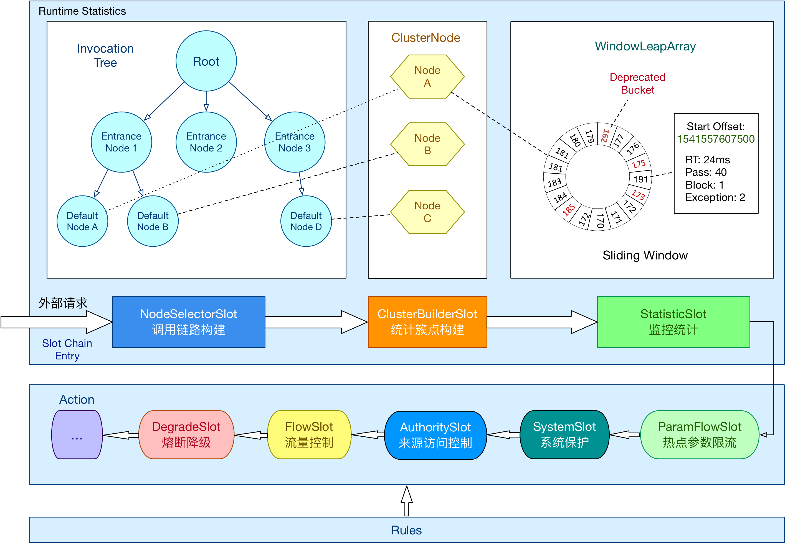
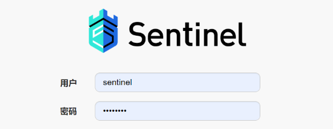
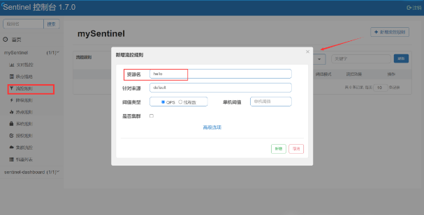

# Sentinel实操：微服务稳定性的流量守护神

应运时代而生的Sentinel，旨在为分布式系统提供流量控制和熔断降级等功能，维护服务之间的稳定性。从12年由阿里巴巴中间件团队推出至今，已经成为主流的限流中间件，也承接了阿里巴巴近10年的双十一大促流量的核心场景，例如秒杀、消息削峰填谷、集群流量控制等。

项目地址：https://github.com/alibaba/Sentinel，
总体架构图如下:


下来一起来简单实操体验一下

## 1、docker部署

推荐使用docker部署sentinel

1.  安装docker


    apt install docker.io

2.  启动docker守护进程


    systemctl start docker

3.  拉取镜像


    docker pull bladex/sentinel-dashboard:1.7.0

4.  容器运行


    docker run --name sentinel -d -p 8858:8858 bladex/sentinel-dashboard:1.7.0

--name取别名，docker run -d后台运行，-p定义端口

5.  查看运行状态


    docker ps -a


6.  访问登录页面


http://localhost:8858，账号/密码：sentinel/sentinel


## 2、Spring整合

1.  maven依赖

```
<dependency>  
    <groupId>com.alibaba.cloud</groupId>  
    <artifactId>spring-cloud-starter-alibaba-sentinel</artifactId>  
    <version>${sentinel.version}</version>  
</dependency>  
```


2.  配置项参数

```
spring.cloud.sentinel.transport.dashboard=localhost:8858  
spring.cloud.sentinel.transport.heartbeat-interval-ms=500  
spring.cloud.sentinel.eager=true
```


注意，sentinel默认采用延迟加载，只有在主动发起一次请求后，才会被拦截并发送给服务端。如果想关闭这个延迟，可以把eager的注释放掉。

## 3、客户端测试

### 3.1 接口限流

按如上步骤新建springBoot项目，整合sentinel，设置项目名参数，方便在sentinel控制台查找该应用：spring.application.name=mySentinel

```
//测试类代码：
@RestController
@RequestMapping("/test")
public class TestController {
    @GetMapping(value = "/fall")
    @SentinelResource(value = "fall")
    public String fall() {
        return "Hello Sentinel";
    }
}
```

启动项目成功后在sentinel控制台显示如下，新建流控规则，单机阙值设置大于0，如1则表示1s内只能访问一次。


资源名和@SentinelResource注解定义的一样，都为"fall"时，触发限流页面返回：Whitelabel Error Page


资源名和接口访问的url一样，都为"/test/fall"时，触发限流页面返回：Blocked by Sentinel (flow limiting)

### 3.2 定义回调

运用到@SentinelResource的两大属性。blockHandler：针对违反Sentinel控制台配置规则时触发BlockException异常时的处理 fallback：针对Java本身出现的异常进行处理。

### 3.2.1 fallback

```
//测试代码：
@RestController
@RequestMapping("/test")
public class TestController {

    /**
     * fallback：针对Java本身出现的异常进行处理的对应属性,触发时会执行对应的方法（如该示例中的getHandlerFallback）
     * @return
     */
    @GetMapping(value = "/fall")
    @SentinelResource(value = "fall", fallback = "getHandlerFallback")
    public String fall(Long id) {
        if(id == 1){
            throw new RuntimeException("程序报错");
        }
        return "Hello Sentinel";
    }

    public static String getHandlerFallBack(BlockException blockException){
        return "执行异常,请检查程序后重试...";
    }
}
```

### 3.2.2 blockHandler

```
//测试代码：
/**
 * blockHandler：针对违反Sentinel控制台配置规则时触发BlockException异常时对应处理的属性,其值“handle”为对应class中的方法
 * @return
 */
@GetMapping(value = "/hand")
@SentinelResource(value = "hand", blockHandler = "handle", blockHandlerClass = SentinelExceptionHandler.class)
public String hand() {
    return "Hello Sentinel";
}

/**
 * BlockException包含很多个子类，分别对应不同的场景：
 * 异常                       说明
 * FlowException             限流异常
 * ParamFlowException        热点参数限流的异常
 * DegradeException          降级异常
 * AuthorityException        授权规则异常
 * SystemBlockException      系统规则异常
 */
@Component
public class SentinelExceptionHandler implements BlockExceptionHandler {
    @Override
    public void handle(HttpServletRequest httpServletRequest, HttpServletResponse response, BlockException e) throws Exception {
        response.setStatus(HttpStatus.TOO_MANY_REQUESTS.value());
        response.setContentType("application/json;charset=utf-8");
        response.getWriter().print("sentinel 限流...");
    }
}
```
大致的使用就是这样了，不过以上例子都是在 Web Servlet 环境下使用的。Sentinel 目前已经支持 Spring WebFlux，需要配合 spring-boot-starter-webflux 依赖触发 sentinel-starter 中 WebFlux 相关的自动化配置。当 Spring WebFlux 应用接入 Sentinel starter 后，所有的 URL 就自动成为 Sentinel 中的埋点资源，不用再额外添加资源注解，可以针对某个 URL 进行流控。

## 4、其他替代框架

那除了sentinel，还有哪些限流组件呢？下面这些发给大家参考：

*   Hystrix：由Netflix开发，是最早的服务保护和断路器模式实现之一。尽管Netflix宣布不再积极开发Hystrix，但它仍然被广泛使用，并且有一个活跃的社区维护着该项目。

*   Resilience4j：这是一个轻量级的容错库，专为Java 8和函数式编程设计。它提供了断路器、限流器和重试机制等功能，是Spring Cloud之外的另一个选择。

*   Spring Cloud Circuit Breaker：这是Spring Cloud提供的一个抽象层，它整合了多种断路器实现，包括Hystrix、Resilience4j和Sentinel。

*   Istio：如果你的应用部署在Kubernetes上，Istio提供了一种服务网格解决方案，其中包括了流量管理、安全通信、监控等功能，也可以用于实现服务间的流量控制和熔断降级。

