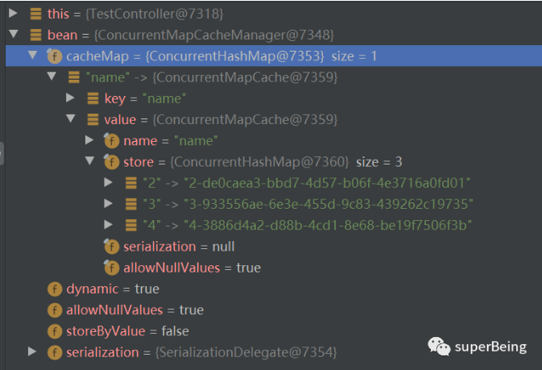
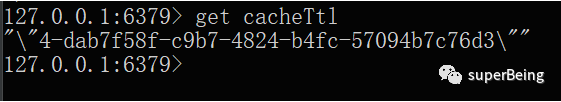

# Spring cache解析

本文基于springboot2.3.7版本进行分析，对应的spring-context版本为5.2.12，官方文档地址如下：

> https://docs.spring.io/spring-framework/docs/5.2.12.RELEASE/spring-framework-reference/integration.html#cache

一、spring cache默认实现

1.  springboot启动类添加@EnableCaching注解开启缓存，新增SpringContextUtil应用上下文用于获取bean


```
@Component
```

2.测试TestController类

```
@RequestMapping("/test")
```

3.多次调用name接口，检查cacheManager，可以发现spring Cache默认实现是concurrentMapCacheManager，里面是一个嵌套的hashMap，外层cacheMap用于存放value定义的"name"名称，内层store存放真正的缓存数据


4.store存放/name接口返回值的具体逻辑由cacheInterceptor拦截器实现，cacheInterceptor会执行CacheAspectSupport中的apply方法缓存接口返回值

```
public void apply(@Nullable Object result) {
```


二、设置缓存过期时间

concurrentMapCacheManager并没有提供ttl设置，删除缓存只能通过evict，可以利用java继承特性，覆盖spring默认获取缓存方法，增加ttl校验

1.  继承默认缓存处理器ConcurrentMapCacheManager


```
@EnableCaching
```

2.继承默认缓存实现concurrentMapCache

```
public class ConcurrentTTLCache extends ConcurrentMapCache {
```

3.定义包含时间属性的抽象父类和继承子类

```
@Data
```

4.实践测试，当触发缓存时会执行ConcurrentTTLCache中的lookup方法判断时间是否过期

```
@GetMapping("/put")
```


三、切换为redis实现

concurrentMapCache是jvm缓存，无法满足分布式，而且过期时间设置较为麻烦，这时候就需要引入redis

1.添加maven依赖包

```
<dependency>
```

2.系统参数配置

```
spring.redis.host=http://localhost
```

3.设置缓存管理器

```
@Configuration
```

4.切换为redis后默认所有的缓存有效期设置了10分钟，如果想自定义过期时间，可以增设缓存处理器。做法如下，新增自定义的redisTtlCacheManager处理器，在redisCacheConfig配置类中新增bean

```
public class RedisTtlCacheManager extends RedisCacheManager {
```

```
public class RedisCacheConfig extends CachingConfigurerSupport {
```

5.使用实践，设置过期时间1000s

```
@GetMapping("/name")
```

四、自定义缓存拦截器

1.redisTemplate和redisCacheManager

当添加spring-boot-starter-data-redis依赖包后，就可以使用如下代码操作redis

String value = (String) redisTemplate.opsForValue().get("ab");

当然也可以用继承了cacheManager的redisCacheManager来操作缓存

```
RedisCacheManager cacheManager = SpringContextUtil.getBean(RedisCacheManager.class);
```

两者都可以实现redis缓存运用，其区别是redisTemplate是redis的专用工具类，而cacheManager是spring cache模块提供的一个统一SPI接口，redisCacheManager是对它的实现

2.可以通过redisTemplate和Aspect来实现Spring Cache的整个缓存处理过程。首先参照@Cache注解，定义自己的新注解@CacheTtl，新增ttl时间属性

```
@Target(ElementType.METHOD)
```

3.新增缓存拦截器，针对使用了@CacheableTtl注解的方法设置缓存

```
@Component
```

4.使用自定义注解测试

```
@GetMapping("/ttl")
```

可以看到数据已经被存入redis中！

